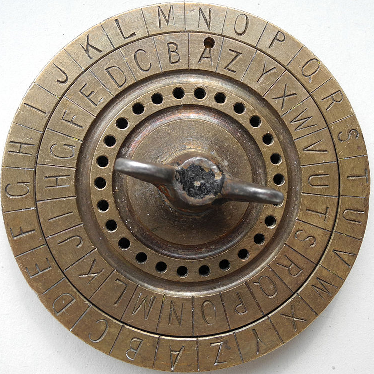
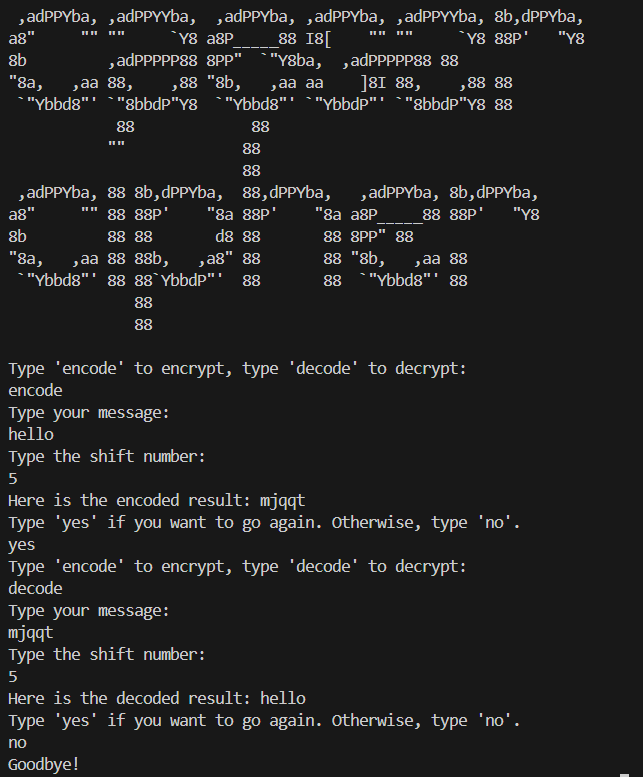

# Caesar-Cipher
A simple program built in Python that encodes and decodes text!

## A Short History Lesson
As I progress through my 100 days of coding challenge, I have ended up creating a Caesar cipher. program.

The Caesar cipher originates from Julius Caesar himself who used to encode messages by shifting the letters of the message 3 places down the alphabet. So for example, A would become D and the recipient would get the encoded message with the shift number in order to decode it. They even had discs for this such as the one below:

Caesar's nephew, Augustus, used a similar cipher with a right shift of one, but without wrapping around the alphabet so Z became AA.

The Caesar cipher's weakness was later broken in the 9th century by Al-Kindi, an Arab Muslim polymath, often hailed as the "father of Arab philosophy".

Up to this day, simple varations of this cipher are used, such as ROT13 (a shift by 13) to hide online jokes and spoilers!

## How the code works

Upon running the code, some beautiful ASCII art pops up in the terminal followed by text that will prompt the user to type in whether they would like to encode or decode, proceeded by allowing the user to enter some text and asking for their preferred shift number.

The code then produces the requested message and will give the user a choice to go again. 

It is simply a program made up of a main function that is called inside a while loop!

Take a look below to see an example of how it runs:

